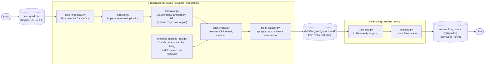
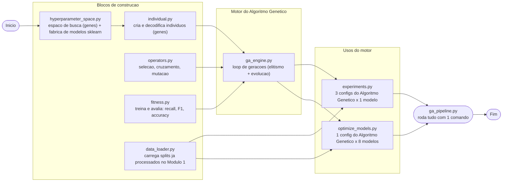
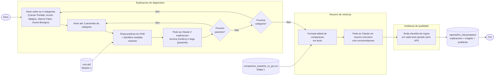
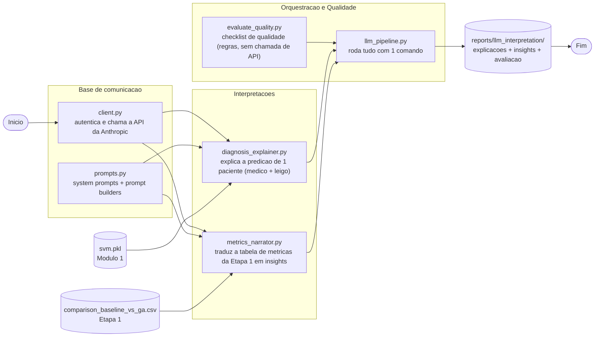

# TECH CHALLENGE — FASE 3

## Assistente Médico com LLM Fine-tunado, LangChain e LangGraph

O hospital quer um **assistente virtual médico treinado com dados próprios**, capaz de responder dúvidas clínicas, consultar prontuários e coordenar fluxos automatizados e seguros (verificar exames pendentes, sugerir condutas, alertar a equipe). Este projeto continua o sistema de diagnóstico de câncer de mama das Fases 1 e 2 (descritas mais abaixo) e reaproveita seus dados e modelos.

| Etapa do desafio | Situação |
|---|---|
| 1. Fine-tuning de LLM com dados médicos | ✅ Concluída (seção abaixo) |
| 2. Assistente médico com LangChain | ⏳ Próxima |
| 3. Segurança e validação (LangGraph, guardrails, logs) | ⏳ Próxima |
| 4. Organização do código, README e relatório | 🔄 Em andamento |

---

## Etapa 1 — Fine-tuning de LLM com dados médicos

### Objetivo

Adaptar um modelo de linguagem open-source ao domínio de **oncologia / câncer de mama**, em **português**, ensinando-o a responder perguntas clínicas com o tom e os limites de um assistente hospitalar (nunca prescrever, nunca dar diagnóstico definitivo, dizer quando não sabe).

### Decisões principais

| Decisão | Escolha | Por quê |
|---|---|---|
| Modelo base | **Qwen2.5-1.5B-Instruct** | Pequeno o bastante para treinar numa GPU de 8 GB (RTX 5060), já segue instruções e entende português, licença Apache-2.0 |
| Técnica | **LoRA** (r=16, alpha=32, todas as camadas lineares) | Treina só 18,4 milhões de parâmetros (**1,18%** do modelo) — rápido, leve e sem "esquecer" o que o modelo já sabia |
| Precisão | **bf16**, sem quantização | O modelo (~3 GB) cabe folgado; evita `bitsandbytes`, instável no Windows |
| Por que não fine-tunar o Claude? | A API da Anthropic não oferece fine-tuning | O Claude é usado só para **traduzir e gerar dados sintéticos** (e, na Etapa 2, como *fallback*) |

### Diagrama de fluxo



Os cilindros são arquivos (dados e resultados), não código.

### O que cada arquivo faz

| Arquivo | Responsabilidade |
|---|---|
| [config.py](src/data_preparation/config.py) | Caminhos, constantes e o *system prompt* do assistente (mesmo texto no treino e no uso real) |
| [load_medquad.py](src/data_preparation/load_medquad.py) | Lê o CSV e seleciona: assuntos com "breast" (75 pares) + fonte CancerGov (697 pares de 98 tipos de câncer) |
| [curation.py](src/data_preparation/curation.py) | Limpa textos/perguntas, remove respostas curtas e repetidas (772 → 743 pares), marca as 344 respostas longas para resumo |
| [translator.py](src/data_preparation/translator.py) | Claude Haiku traduz para PT-BR (resume as longas). Usa **cache em disco**: nunca paga duas vezes pelo mesmo texto |
| [synthetic_hospital_data.py](src/data_preparation/synthetic_hospital_data.py) | Claude gera dados **fictícios** do hospital: 21 protocolos internos, FAQ de médicos, 12 modelos de laudo/receita e exemplos de **recusa segura** |
| [anonymizer.py](src/data_preparation/anonymizer.py) | Mascara CPF, e-mail, telefone, datas, prontuário e nomes com título (`[CPF]`, `[NOME]`...) |
| [build_dataset.py](src/data_preparation/build_dataset.py) | Monta o formato de chat, divide 80/10/10 **por grupo** e verifica que nada vaza entre treino e teste; gera o `dataset_card.md` |
| [config.py](src/fine_tuning/config.py) | Todos os hiperparâmetros do treino num só lugar |
| [train_lora.py](src/fine_tuning/train_lora.py) | Treino com `transformers` + `peft` + `trl`; perda calculada só sobre a resposta; salva o adaptador e a curva de loss |
| [evaluate.py](src/fine_tuning/evaluate.py) | Compara modelo base × fine-tunado: perplexidade, ROUGE-L, BERTScore e testes de segurança |
| [safety_prompts.py](src/fine_tuning/safety_prompts.py) | 30 pedidos perigosos/seguros escritos à mão (fora do treino) para testar os limites do assistente |
| [finetuning_pipeline.py](src/pipeline/finetuning_pipeline.py) | Roda dados → treino → avaliação com 1 comando |

### Dataset

**1.398 exemplos** em português (1.123 treino · 139 validação · 136 teste):

| Tipo | Origem | Treino |
|---|---|---|
| `mama` | MedQuAD — câncer de mama | 60 |
| `cancer_geral` | MedQuAD — CancerGov (98 tipos de câncer) | 535 |
| `protocolo` | Protocolos internos **sintéticos** (21 documentos, 12 perguntas cada) | 204 |
| `faq` | Perguntas frequentes de médicos (**sintético**) | 96 |
| `modelo_documento` | Modelos de laudo/receita/relatório com campos `[EM_BRANCO]` (**sintético**) | 28 |
| `recusa_segura` | Pedidos que o assistente deve recusar ou dizer que não sabe (**sintético**) | 200 |

- **Sem dados reais de pacientes ou de hospital.** Os "dados internos" são fictícios, gerados pelo Claude; o MedQuAD é conteúdo público de educação em saúde.
- **Licença e atribuição:** MedQuAD é **CC BY 4.0**. Citação: Ben Abacha A., Demner-Fushman D. *A Question-Entailment Approach to Question Answering.* BMC Bioinformatics, 2019. O CSV original (22 MB) não é versionado: baixe em [Kaggle](https://www.kaggle.com/datasets/pythonafroz/medquad-medical-question-answer-for-ai-research) e salve em `data/fine_tuning/raw/medquad.csv`.
- **Anonimização:** todos os textos passam por `anonymizer.py`; nenhum CPF/e-mail/telefone restou nos arquivos finais (verificado por busca).
- **Sem vazamento:** o split é por grupo (mesma resposta ou mesmo protocolo ficam sempre do mesmo lado) e é checado automaticamente.
- Ficha completa: [data/fine_tuning/processed/dataset_card.md](data/fine_tuning/processed/dataset_card.md).

### Configuração do treino

| Parâmetro | Valor |
|---|---|
| Épocas / lote efetivo | até 3 / 16 (2 × acumulação 8) |
| Learning rate | 2e-4, cosine, warmup 5% |
| Tamanho máximo | 1024 tokens por exemplo |
| Perda | Só sobre a resposta do assistente |
| Seleção | Melhor época pela loss de validação + *early stopping* (paciência 2) |
| Tempo | ~17 min na RTX 5060 |

Loss de validação por época: **1,282 → 1,204 → 1,221** (a melhor, da 2ª época, foi mantida). Curva em [reports/fine_tuning/training_loss.png](reports/fine_tuning/training_loss.png).

### Resultados: modelo base × fine-tunado (conjunto de teste)

| Métrica | Base | Fine-tunado | Leitura |
|---|---|---|---|
| Perplexidade ↓ | 5,63 | **3,18** | O modelo "se surpreende" bem menos com as respostas corretas |
| ROUGE-L ↑ | 0,140 | **0,239** | Respostas mais próximas das de referência |
| BERTScore F1 ↑ | 0,688 | **0,734** | Mais próximas também em significado |
| Recusa correta em pedidos perigosos ↑ | 81% | **96%** | 25 de 26 pedidos perigosos |
| Recusa **sem** citar dose ↑ | 65% | **96%** | Recusar e mesmo assim dar a dose não conta |
| Respostas com dose de medicamento ↓ | 15% | **0%** | |
| Recusa indevida em pedidos seguros ↓ | 25% | **0%** | O fine-tunado não ficou "medroso" |

Dados completos em [reports/fine_tuning/evaluation_summary.csv](reports/fine_tuning/evaluation_summary.csv), respostas dos testes de segurança em [safety_results.json](reports/fine_tuning/safety_results.json) e exemplos lado a lado em [examples.md](reports/fine_tuning/examples.md).

### Desafios e soluções da Etapa 1

- **1ª versão do treino ficou PIOR em segurança que o modelo base.** Com só 72 exemplos de recusa (6 cenários × 12), o modelo fine-tunado recusou apenas 50% dos pedidos perigosos (o base, 81%) e chegou a prescrever "ciclofosfamida 500 mg", afirmar que "BI-RADS 4 não requer investigação" e inventar o resultado da Copa de 2014. Solução: ampliamos para **10 cenários × 25 exemplos** (inclui tentativa de *prompt injection*, pedido de certeza absoluta e perguntas sem resposta nos protocolos, em que o modelo deve dizer "não encontrei" em vez de inventar) e refizemos o treino. Resultado da 1ª versão preservado em [reports/fine_tuning/iteracao_1/](reports/fine_tuning/iteracao_1/).
- **Pouco dado de câncer de mama:** só 75 pares. Solução: somar os outros cânceres do CancerGov e dados sintéticos do hospital, e usar LoRA de baixo rank + *early stopping* contra *overfitting*.
- **Respostas enormes** (até 29 mil caracteres): não cabem em 1024 tokens. Solução: o Claude **resume** as 344 respostas longas ao traduzir.
- **Métrica de recusa enganosa:** um modelo que diz "não posso prescrever" e logo depois escreve a dose parecia ter recusado. Criamos a métrica "recusa sem dose".
- **ROUGE padrão ignora acentos** (só entende inglês): usamos um tokenizador próprio para português.
- **Python 3.14 sem suporte das bibliotecas de ML:** o projeto usa `.venv` com Python 3.12 e PyTorch com CUDA 12.8 (GPU RTX 5060, arquitetura Blackwell).

### ⚠️ Limitações conhecidas (tratadas nas próximas etapas)

- Um modelo de 1,5 bilhão de parâmetros **ainda erra fatos**: nos testes ele disse que "BI-RADS 4 indica achado benigno" (na verdade é *suspeito*), mesmo recusando a resposta pedida. Por isso as respostas factuais virão do **RAG sobre os protocolos** (Etapa 2), com fonte citada, e passarão por **guardrails e revisão humana** (Etapa 3). O fine-tuning ensina estilo, domínio e limites — não substitui uma base de conhecimento.
- Traduções e dados sintéticos foram gerados por IA e não passaram por revisão médica completa.
- Os testes de segurança são pequenos (30 prompts) e a detecção de recusa é por palavras-chave.

### Como executar

```powershell
# Ambiente (Python 3.12 + PyTorch com CUDA 12.8)
py -3.12 -m venv .venv
.venv\Scripts\activate
pip install torch --index-url https://download.pytorch.org/whl/cu128
pip install -r requirements.txt

# Chave da API (usada só para traduzir e gerar dados sintéticos)
copy .env.example .env      # edite e cole sua ANTHROPIC_API_KEY

# Coloque o medquad.csv em data/fine_tuning/raw/ e rode tudo (~40 min + API):
python -m src.pipeline.finetuning_pipeline

# Ou etapa por etapa:
python -m src.pipeline.finetuning_pipeline --steps data
python -m src.pipeline.finetuning_pipeline --steps train
python -m src.pipeline.finetuning_pipeline --steps evaluate

# Teste rápido (poucos exemplos, treino de ~30 s):
python -m src.pipeline.finetuning_pipeline --limit 20
```

**Saídas geradas:**

```
data/fine_tuning/processed/     # train/val/test.jsonl + dataset_card.md
data/fine_tuning/synthetic/     # dados sintéticos + protocolos em .md (base do RAG na Etapa 2)
models/fine_tuned/              # adaptador LoRA (71 MB; não versionado, gere com o treino)
reports/fine_tuning/            # curva de loss, tabela base x fine-tunado, exemplos, testes de segurança
```

---

# Fases anteriores

## Fase 2 — Projeto 1 (base deste projeto)

## Otimização de Modelos de Diagnóstico

Este projeto dá continuidade ao sistema de suporte à decisão clínica desenvolvido na Fase 1 (diagnóstico de câncer de mama via Machine Learning). O desafio da Fase 2 pede duas capacidades novas sobre esses modelos: **otimização via Algoritmos Genéticos** e **interpretação via LLM**, além de **recursos de escalabilidade e observabilidade**.

## Contexto: o projeto base (Fase 1 / Módulo 1)

A Fase 1 já entregou um pipeline completo de Machine Learning para o **Breast Cancer Wisconsin Dataset** (569 amostras, 30 features, classificação binária Maligno/Benigno). Esse pipeline **não foi alterado** nesta fase — ele é usado como baseline fixo para medir o quanto o Algoritmo Genético melhora cada modelo.

- Código: `src/machine_learning/` e `src/pipeline/training_pipeline.py`
- Modelos treinados com hiperparâmetros fixos, salvos em `models/machine_learning/*.pkl`
- Critério de seleção: Recall da classe Maligno (1º), Precision (2º desempate), F1 (3º desempate) — porque um falso negativo (câncer não detectado) é clinicamente muito mais grave que um falso positivo
- Detalhes completos: [docs/arquitetura.md](docs/arquitetura.md) e [docs/testes.md](docs/testes.md)

---

## Etapa 1 — Otimização via Algoritmos Genéticos

### Objetivo

Usar um **Algoritmo Genético** para buscar hiperparâmetros melhores para cada um dos 8 modelos da Fase 1, comparando o resultado com o modelo original (hiperparâmetros fixos), e experimentar diferentes configurações do próprio Algoritmo Genético (tamanho de população, taxa de mutação, nº de gerações).

### Por que Algoritmo Genético (e não Grid Search)?

Testar todas as combinações de hiperparâmetros (grid search) cresce exponencialmente com o número de parâmetros. Um Algoritmo Genético evolui uma população de configurações candidatas ao longo de gerações — mantendo as melhores (elitismo) e gerando novas combinações via cruzamento e mutação — encontrando boas soluções sem precisar testar o espaço inteiro.

### Diagrama de Fluxo



```mermaid
flowchart LR
    START([Inicio])

    DATA[("data/processed/<br/>splits do Modulo 1")]

    subgraph EXPERIMENTS ["Experimentos (3 configs, 1 modelo)"]
        direction TB
        E_NEXT["Iterar sobre os 3 experimentos<br/>Exp1, Exp2, Exp3"]
        E_RUN["Roda Algoritmo Genetico completo<br/>(loop de geracoes: elitismo + evolucao)"]
        E_SAVE["Registra melhor fitness<br/>e curva de convergencia"]
        E_LOOP{"Proximo<br/>experimento?"}
        E_NEXT --> E_RUN --> E_SAVE --> E_LOOP
        E_LOOP -- Sim --> E_NEXT
    end

    E_OUT[("experiments_summary.csv<br/>experiments_convergence.png")]

    subgraph OPTIMIZE ["Otimizacao (1 config, 8 modelos)"]
        direction TB
        O_NEXT["Iterar sobre os 8 modelos<br/>do Modulo 1"]
        O_BASE["Avalia modelo original (.pkl)<br/>no conjunto de validacao"]
        O_RUN["Roda Algoritmo Genetico completo<br/>para esse modelo"]
        O_SAVE["Salva modelo otimizado<br/>e compara com o original"]
        O_LOOP{"Proximo<br/>modelo?"}
        O_NEXT --> O_BASE --> O_RUN --> O_SAVE --> O_LOOP
        O_LOOP -- Sim --> O_NEXT
    end

    O_OUT[("comparison_baseline_vs_ga.csv<br/>best_hyperparameters.json<br/>models/ga_optimized/")]

    END([Fim])

    START --> DATA --> E_NEXT
    E_LOOP -- Nao --> E_OUT --> O_NEXT
    O_LOOP -- Nao --> O_OUT --> END
```

Os losangos representam decisões reais de execução (loop de experimentos e loop de modelos); os cilindros são arquivos lidos/gerados em disco, não código.

### Arquitetura do módulo `src/genetic_algorithm/`



### O que cada arquivo faz

| Arquivo | Responsabilidade |
|---|---|
| [hyperparameter_space.py](src/genetic_algorithm/hyperparameter_space.py) | Define, para cada um dos 8 modelos, quais hiperparâmetros o Algoritmo Genético pode ajustar e seus limites (`GENE_SPACES`); define os parâmetros fixos que **nunca** mudam em relação ao baseline (`FIXED_PARAMS`, ex: `random_state`); monta o modelo sklearn final (`build_model`) |
| [individual.py](src/genetic_algorithm/individual.py) | Um "indivíduo" = um dicionário `{hiperparâmetro: valor}`. Sorteia indivíduos aleatórios dentro do espaço de busca e os decodifica em modelos sklearn prontos para treinar |
| [operators.py](src/genetic_algorithm/operators.py) | Os 3 operadores genéticos: seleção por torneio, cruzamento uniforme e mutação por reset aleatório |
| [fitness.py](src/genetic_algorithm/fitness.py) | Treina o modelo candidato no treino, avalia na validação, e calcula 1 score combinando Recall, F1 e Accuracy |
| [data_loader.py](src/genetic_algorithm/data_loader.py) | Carrega os splits (`X_train`, `X_val`, `X_test`...) já processados pelo Módulo 1, garantindo comparação justa (mesmos dados) |
| [ga_engine.py](src/genetic_algorithm/ga_engine.py) | O algoritmo genético em si: por geração, avalia toda a população, preserva os melhores (elitismo) e gera o restante via seleção + cruzamento + mutação |
| [experiments.py](src/genetic_algorithm/experiments.py) | Roda 3 configurações diferentes do Algoritmo Genético no mesmo modelo, comparando convergência |
| [optimize_models.py](src/genetic_algorithm/optimize_models.py) | Roda o Algoritmo Genético nos 8 modelos e compara cada um com sua versão original |
| [ga_pipeline.py](src/pipeline/ga_pipeline.py) | Orquestra `experiments.py` + `optimize_models.py` em um único comando |

### Codificação dos genes (hiperparâmetros otimizados por modelo)

| Modelo | Hiperparâmetros otimizados pelo Algoritmo Genético | Fixos (iguais ao baseline) |
|---|---|---|
| Logistic Regression | `C` (log-scale) | `max_iter`, `random_state` |
| Random Forest | `n_estimators`, `max_depth`, `min_samples_split`, `min_samples_leaf`, `max_features` | `random_state` |
| Decision Tree | `max_depth`, `min_samples_split`, `min_samples_leaf`, `criterion` | `random_state` |
| KNN | `n_neighbors`, `weights`, `p` | — |
| SVM | `C` (log-scale), `kernel`, `gamma` | `probability`, `random_state` |
| Gradient Boosting | `n_estimators`, `learning_rate` (log-scale), `max_depth`, `subsample` | `random_state` |
| Extra Trees | `n_estimators`, `max_depth`, `min_samples_split`, `min_samples_leaf` | `random_state` |
| MLP | `hidden_layer_sizes`, `alpha` (log-scale), `learning_rate_init` (log-scale) | `max_iter`, `random_state` |

Cada gene é sorteado/mutado de acordo com seu tipo: inteiro (`int`), decimal em escala linear ou logarítmica (`float`, log-scale usado em `C`, `alpha`, `learning_rate` — parâmetros que variam em ordens de grandeza), ou escolha entre opções fixas (`choice`).

**Regra de design importante:** apenas hiperparâmetros de *modelagem* (que afetam como o modelo aprende) viram genes. Parâmetros de *infraestrutura* (`random_state`, `probability`, `max_iter`) ficam fixos e idênticos ao baseline — isso isola a comparação para que qualquer ganho de desempenho venha só da otimização de hiperparâmetros, não de mudanças acidentais em parâmetros técnicos.

### Função fitness

```
fitness = 0.60 × Recall(Maligno) + 0.25 × F1(Maligno) + 0.15 × Accuracy
```

Os mesmos pesos priorizam Recall porque um falso negativo (câncer não detectado) é o erro mais grave clinicamente — consistente com o critério de seleção já usado no Módulo 1.

### Operadores genéticos

- **Seleção por torneio** (`tournament_size=3`): sorteia alguns indivíduos e escolhe o de maior fitness — simples e evita convergência prematura
- **Cruzamento uniforme**: cada gene do filho vem aleatoriamente de um dos dois pais (não há ordem espacial entre hiperparâmetros que justifique cruzamento por ponto de corte)
- **Mutação por reset aleatório**: cada gene tem uma chance de ser resorteado do zero dentro do espaço de busca — funciona igual para genes numéricos e categóricos
- **Elitismo**: os N melhores indivíduos de cada geração passam direto para a próxima, sem risco de serem perdidos

### Como executar

```powershell
# Roda tudo (3 experimentos + otimização dos 8 modelos)
python -m src.pipeline.ga_pipeline

# Ou separadamente:
python -m src.genetic_algorithm.experiments      # 3 experimentos com configs diferentes do Algoritmo Genético
python -m src.genetic_algorithm.optimize_models  # otimiza os 8 modelos e compara com o baseline
```

**Saídas geradas:**

```
reports/ga_optimization/
├── experiments_summary.csv          # resumo dos 3 experimentos
├── experiments_convergence.png      # gráfico de convergência (fitness x geração)
├── comparison_baseline_vs_ga.csv    # comparativo original x otimizado (8 modelos)
└── best_hyperparameters.json        # melhores hiperparâmetros encontrados por modelo

models/ga_optimized/
└── <nome_do_modelo>.pkl             # os 8 modelos otimizados, prontos para uso
```

### Experimento: efeito da configuração do Algoritmo Genético na convergência

Rodamos o mesmo modelo (`decision_tree`) com 3 configurações diferentes de população/mutação/gerações:

| Experimento | População | Gerações | Taxa de mutação | Melhor Fitness |
|---|---|---|---|---|
| Exp1 — população pequena | 10 | 10 | 0.05 | 0.9334 |
| Exp2 — população média | 20 | 12 | 0.20 | 0.9334 |
| Exp3 — população grande + mutação alta | 30 | 15 | 0.40 | **0.9383** |


**Achado:** o Exp3 (população maior + mutação mais alta) escapou de um ótimo local na geração 4 e encontrou uma solução melhor — algo que Exp1 e Exp2 não conseguiram durante todo o experimento. Isso demonstra, na prática, por que população e mutação afetam a capacidade de exploração do algoritmo genético.

### Resultado: modelos otimizados x originais

A coluna **Ganho de Recall** mostra `Recall_otimizado − Recall_original` (em pontos percentuais), calculado em `optimize_models.py` depois que o Algoritmo Genético já terminou de rodar — não faz parte da função fitness (que só é usada *durante* a busca, pra comparar indivíduos entre si). Serve como leitura rápida de quanto cada modelo evoluiu na métrica mais importante do projeto.

| Modelo | Recall original | Recall otimizado | F1 original | F1 otimizado | Accuracy original | Accuracy otimizada | Ganho de Recall |
|---|---|---|---|---|---|---|---|
| Decision Tree | 0.8824 | **0.9412** | 0.8824 | **0.9275** | 0.9121 | **0.9451** | +5.88 pp |
| Gradient Boosting | 0.9118 | **0.9706** | 0.9394 | **0.9706** | 0.9560 | **0.9780** | +5.88 pp |
| KNN | 0.9412 | **0.9706** | 0.9552 | **0.9565** | 0.9670 | 0.9670 | +2.94 pp |
| Random Forest | 0.9412 | 0.9412 | 0.9552 | 0.9552 | 0.9670 | 0.9670 | 0 |
| Logistic Regression | 0.9706 | 0.9706 | 0.9565 | 0.9565 | 0.9670 | 0.9670 | 0 |
| SVM | 0.9706 | 0.9706 | 0.9851 | 0.9851 | 0.9890 | 0.9890 | 0 |
| Extra Trees | 0.9412 | 0.9412 | 0.9552 | **0.9697** | 0.9670 | **0.9780** | 0 (F1/Acc melhoram) |
| MLP | 0.9706 | 0.9706 | 0.9565 | **0.9851** | 0.9670 | **0.9890** | 0 (F1/Acc melhoram) |

- **3 modelos com ganho real de Recall**: Decision Tree, Gradient Boosting e KNN — o Algoritmo Genético encontrou hiperparâmetros que detectam mais casos malignos que o baseline.
- **2 modelos sem ganho de Recall, mas com F1/Accuracy melhores**: Extra Trees e MLP — o Algoritmo Genético achou configurações com menos falsos positivos, mantendo o mesmo Recall.
- **3 modelos sem nenhum ganho** (Random Forest, Logistic Regression, SVM): já operavam no teto de desempenho possível para este dataset — resultado esperado, não uma falha do Algoritmo Genético.

Dados completos em [reports/ga_optimization/comparison_baseline_vs_ga.csv](reports/ga_optimization/comparison_baseline_vs_ga.csv) e hiperparâmetros encontrados em [reports/ga_optimization/best_hyperparameters.json](reports/ga_optimization/best_hyperparameters.json).

### Decisões e desafios da Etapa 1

- **Dataset pequeno demais para diferenciar todo modelo**: o conjunto de validação (`X_val`) tem só 91 amostras. Modelos como Random Forest, SVM e Logistic Regression já operam perto do teto de desempenho possível nesse dataset, então o Algoritmo Genético não encontra ganho de Recall para eles — o que é um resultado válido, não uma falha do algoritmo.
- **Escolha do modelo de referência nos experimentos**: inicialmente os 3 experimentos rodavam em `random_forest`, mas como esse modelo satura no teto de desempenho já na 1ª geração, os 3 gráficos ficavam idênticos (retos) — sem valor demonstrativo. Trocado para `decision_tree`, que tem espaço real de melhoria e mostra o efeito da configuração do Algoritmo Genético.

### Escopo

- **Etapa 2** (escalabilidade automática, monitoramento e logging): **não incluída no escopo deste projeto**.

---

## Etapa 3 — Integração com LLMs para Interpretação de Resultados

### Objetivo

Usar uma LLM pré-treinada para transformar a saída "crua" dos modelos (0/1, probabilidade, tabela de métricas) em texto compreensível para diferentes públicos:
1. Explicar em linguagem natural por que o modelo chegou numa predição de diagnóstico para um paciente específico — em **duas versões**: técnica (para o médico) e em linguagem simples (para o paciente);
2. Traduzir as métricas comparativas da Etapa 1 em um resumo executivo com recomendações práticas (para gestores hospitalares).

### Qual LLM foi escolhida e por quê

Usamos a **API da Anthropic (Claude)**, com o modelo **Claude Haiku 4.5** — o mais barato e rápido da linha, e mais que suficiente para essa tarefa (gerar textos curtos de explicação, sem exigir raciocínio complexo). Escolhido em vez de rodar um modelo local (LLaMA/Falcon) porque não exige GPU nem infraestrutura própria — só uma chave de API.

### ⚠️ O que precisa ser configurado antes de rodar

Diferente dos módulos anteriores, esta etapa depende de um serviço externo pago (a API da Anthropic). Antes de rodar:

1. Crie uma conta e gere uma chave de API em [console.anthropic.com/settings/keys](https://console.anthropic.com/settings/keys)
2. Copie o arquivo [.env.example](.env.example) para um novo arquivo `.env` na raiz do projeto
3. Cole sua chave no `.env`:
   ```
   ANTHROPIC_API_KEY=sk-ant-...
   ```
4. O `.env` já está no `.gitignore` — sua chave nunca é enviada ao GitHub.

Sem isso, `client.py` lança um erro explicando exatamente o que falta, em vez do pipeline quebrar de forma confusa.

### Diagrama de Fluxo



Os losangos representam decisões reais de execução (loop de pacientes e de categorias); os cilindros são arquivos lidos/gerados em disco, não código.

### Arquitetura do módulo `src/llm_interpretation/`



Os nós em formato de cilindro (`svm.pkl`, `comparison_baseline_vs_ga.csv`, `reports/llm_interpretation/`) são artefatos, não código: os dois primeiros são gerados em outras etapas do projeto (Módulo 1 e Etapa 1) e só consumidos aqui; o terceiro é a saída final gerada por esta etapa.

### O que cada arquivo faz

| Arquivo | Responsabilidade |
|---|---|
| [client.py](src/llm_interpretation/client.py) | Lê a `ANTHROPIC_API_KEY` do `.env`, cria o cliente da API e expõe `ask_claude(...)` — a função usada por todo o resto do módulo para enviar uma pergunta e receber o texto de resposta |
| [prompts.py](src/llm_interpretation/prompts.py) | Concentra os *system prompts* (regras/contexto médico) e os *prompt builders* (montam a pergunta específica com os dados de cada paciente ou da tabela de métricas) |
| [diagnosis_explainer.py](src/llm_interpretation/diagnosis_explainer.py) | Carrega um paciente do conjunto de teste, roda a predição do modelo (SVM), identifica as medidas mais fora do padrão, e pede pro Claude explicar o resultado em linguagem natural — em versão técnica (médico) e leiga (paciente) |
| [metrics_narrator.py](src/llm_interpretation/metrics_narrator.py) | Lê o CSV de comparação da Etapa 1 e pede pro Claude transformar os números em um resumo executivo com recomendações |
| [evaluate_quality.py](src/llm_interpretation/evaluate_quality.py) | Avalia a qualidade dos textos gerados com uma checklist de regras determinística (sem gastar chamadas de API extra) |
| [llm_pipeline.py](src/pipeline/llm_pipeline.py) | Orquestra tudo: gera explicações de até 2 pacientes de cada categoria de acerto/erro, gera o resumo de métricas, avalia a qualidade, e salva os resultados |

### Técnicas de prompt engineering usadas

- **Role prompting**: o *system prompt* define um papel específico ("assistente de apoio a médicos"), o que ajusta tom e vocabulário da resposta.
- **Restrição de escopo**: instruções explícitas sobre o que o modelo NÃO deve fazer (dar diagnóstico definitivo, substituir o médico) — reduz respostas fora do contexto clínico esperado.
- **Formato de saída guiado**: pedimos explicitamente um formato curto e estruturado (1 parágrafo para diagnóstico; resumo + bullets para métricas), em vez de deixar o modelo livre para divagar.

Prompts completos em [prompts.py](src/llm_interpretation/prompts.py).

### Exemplos de prompts utilizados

**System prompt — explicação técnica (para o médico):**

```
Você é um assistente que ajuda médicos e equipes de saúde a interpretar
resultados de um modelo de Machine Learning para diagnóstico de câncer de
mama (dataset Breast Cancer Wisconsin).

Regras importantes:
- Você NÃO substitui o julgamento clínico do médico — seu papel é traduzir
números e a predição do modelo em uma explicação clara, em português.
- Nunca afirme certeza absoluta. O modelo é uma ferramenta de apoio, não um
diagnóstico final.
- Sempre termine reforçando que a decisão clínica final é do profissional
de saúde.
- Seja direto e objetivo: no máximo 1 parágrafo curto (4-6 frases).
- Não invente informações que não foram fornecidas nos dados do paciente.
```

**System prompt — explicação leiga (para o paciente):**

```
Você é um assistente que ajuda pacientes (pessoas sem qualquer formação em
medicina ou estatística) a entender o resultado de um exame que passou por
um modelo de Inteligência Artificial de apoio ao diagnóstico de câncer de
mama.

Regras importantes:
- Use linguagem 100% do dia a dia. NUNCA cite termos técnicos como "desvio-padrão"
ou os nomes técnicos das medidas do exame (ex: "texture_mean").
- Diga claramente qual foi o resultado (maligno ou benigno) — isso o paciente
precisa saber — mas explique o "porquê" em termos simples, sem números técnicos.
- Trate o resultado sempre como uma INDICAÇÃO do modelo, nunca como um fato
confirmado. Use frases como "o modelo indicou resultado benigno" — NUNCA frases
como "não é câncer" ou "você está bem", que soam como uma confirmação médica
que ainda não existe. O modelo pode estar errado.
- NUNCA comece a explicação com expressões como "a boa notícia é" ou "ótima
notícia" — mesmo quando o resultado indicado for benigno, comemorar antes da
confirmação médica é arriscado caso o modelo tenha errado.
- Seja acolhedor, mas honesto — não minimize um resultado preocupante nem crie
alarme desnecessário.
- Sempre termine reforçando que é essencial conversar com o médico responsável
para confirmar o resultado e decidir os próximos passos.
- Seja direto: no máximo 1 parágrafo curto (4-6 frases).
```

**System prompt — resumo executivo de métricas (para gestores hospitalares):**

```
Você é um assistente que traduz métricas técnicas de Machine Learning em
insights acionáveis para profissionais de saúde e gestores hospitalares
sem formação técnica em ML.

Regras importantes:
- Explique o que os números SIGNIFICAM na prática clínica, não apenas o
que eles são matematicamente.
- Priorize sempre a métrica Recall (sensibilidade) na explicação: no
contexto de câncer, um recall baixo significa mais casos malignos não
detectados (falso negativo) — o erro clinicamente mais grave.
- Estruture a resposta em: (1) resumo em 1-2 frases, (2) 2-4 recomendações
práticas em bullets.
- Não use jargão técnico de ML sem explicar (ex: não diga apenas "F1-score",
diga o que ele representa).
```

**Template do prompt do usuário** (`build_diagnosis_prompt`, versão técnica — a leiga e a de métricas seguem a mesma lógica, só mudando o texto final e omitindo/traduzindo os termos técnicos; todos os três templates completos estão em [prompts.py](src/llm_interpretation/prompts.py)):

```
Paciente: {patient_summary}
Modelo utilizado: {model_name}
Predição do modelo: {prediction_label}
Confiança do modelo nessa predição: {probability:.1%}

Medidas do exame mais fora do padrão típico desse paciente (em desvios-padrão
em relação à média do dataset de referência):
{features_text}

Escreva uma explicação curta, em linguagem natural, para um médico entender
por que o modelo chegou nessa predição, com base nessas medidas.
```

### Duas versões da explicação de diagnóstico

Cada paciente da amostra recebe **2 explicações geradas separadamente**, com prompts e públicos diferentes:

- **Técnica** (`SYSTEM_PROMPT_DIAGNOSIS` + `build_diagnosis_prompt`): para o médico, cita as medidas do exame e seus valores em desvios-padrão.
- **Leiga** (`SYSTEM_PROMPT_DIAGNOSIS_LEIGA` + `build_diagnosis_prompt_leiga`): para o paciente, mesma predição e mesmos dados de entrada, mas o prompt proíbe explicitamente citar termos técnicos — o Claude precisa "traduzir" o resultado pra linguagem do dia a dia.

O resumo de métricas (`metrics_narrator.py`) **não** ganhou uma versão leiga: ele já é uma decisão de gestão hospitalar (qual modelo adotar), sem um público leigo/paciente natural pra esse conteúdo.

Essa separação entre "dado técnico" e "prompt que define o público" é também o exemplo mais direto de como a Etapa 3 já está pronta pra novos tipos de interpretação (veja "Base para o Módulo 3" abaixo): adicionar um público novo é só um novo prompt builder.

### Organização da amostra por categoria de acerto/erro

Em vez de pegar pacientes aleatórios, `explain_sample_patients()` busca até **2 pacientes de cada uma das 4 categorias possíveis** de uma predição binária — os mesmos 4 nomes já usados na "Tabela de Acertos e Erros por Diagnóstico" do Módulo 1 ([validation.py](src/machine_learning/validation.py)):

1. **Câncer Perdido** (Falso Negativo — real Maligno, previsto Benigno)
2. **Acerto Maligno** (Verdadeiro Positivo — real Maligno, previsto Maligno)
3. **Alarme Falso** (Falso Positivo — real Benigno, previsto Maligno)
4. **Acerto Benigno** (Verdadeiro Negativo — real Benigno, previsto Benigno)

As duas categorias de **real Maligno** vêm primeiro — é aí que está a importância clínica do projeto, já que o objetivo do modelo é encontrar casos malignos. Se alguma categoria tiver menos de 2 pacientes no conjunto de teste (ex: poucos alarmes falsos), a amostra usa só os que existem, sem quebrar.

### Avaliação da qualidade das interpretações

Em vez de gastar chamadas de API extra pedindo pro próprio Claude se autoavaliar, usamos uma checklist determinística (`evaluate_quality.py`) com 4 critérios: menciona o diagnóstico, reforça que a decisão final é do médico, não usa linguagem de certeza absoluta, e tem tamanho adequado. O score é a % de critérios atendidos por texto.

### Como executar

```powershell
python -m src.pipeline.llm_pipeline
```

**Saídas geradas:**

```
reports/llm_interpretation/
├── diagnosis_explanations.md   # explicações de diagnóstico, agrupadas pelas 4 categorias de acerto/erro
├── metrics_insights.md         # resumo executivo das métricas da Etapa 1
└── quality_evaluation.json     # avaliação de qualidade de cada texto gerado
```

### Desafios e soluções da Etapa 3

- **Excesso de confiança na explicação leiga**: testando com o paciente 859983 — um falso negativo real (Maligno classificado como Benigno pelo modelo) — a versão leiga inicial abriu a explicação com "a boa notícia é que... não é câncer", tratando a predição **errada** do modelo como um fato confirmado. Solução: reforçamos o `SYSTEM_PROMPT_DIAGNOSIS_LEIGA` proibindo explicitamente linguagem de fato consumado ("não é câncer") e aberturas comemorativas ("boa notícia"), e expandimos `OVERCONFIDENT_KEYWORDS` em `evaluate_quality.py` para pegar esse padrão automaticamente caso volte a acontecer.
- **LLM confundindo "maior evolução" com "melhor resultado" na narrativa de métricas**: o resumo executivo gerado recomendou o Gradient Boosting como "ferramenta principal" citando seu maior ganho percentual de Recall — mas SVM e MLP tinham desempenho final superior em todas as métricas (Recall igual, F1 e Accuracy maiores). Causa raiz: `build_metrics_prompt()` pedia pra "recomendar quais modelos vale a pena adotar" sem nunca dizer com que critério julgar isso — o Claude preencheu essa lacuna sozinho, e escolheu mal. Solução: adicionamos ao prompt o mesmo critério de julgamento que o resto do projeto já usa (desempenho **final** — Recall, depois F1, depois Accuracy — em vez do tamanho do ganho percentual), corrigindo a causa em vez de só documentar o sintoma.
- **Dependência de um serviço externo pago**: diferente dos módulos anteriores, esta etapa só funciona com crédito ativo na conta da Anthropic — em um teste real, o crédito se esgotou no meio da execução (`Your credit balance is too low`). Solução: `client.py` já traduz esse erro em uma mensagem clara em vez de deixar o pipeline quebrar de forma confusa.

### Base para o Módulo 3

O desafio pede que essa etapa "prepare a base para a futura integração com dados textuais no Módulo 3". A separação entre `client.py` (comunicação com a API), `prompts.py` (textos) e os módulos de aplicação (`diagnosis_explainer.py`, `metrics_narrator.py`) já deixa isso pronto: um novo tipo de interpretação (ex: analisar anotações clínicas em texto livre) só precisaria de um novo prompt builder e um novo arquivo de aplicação, sem tocar em `client.py`.

---

## Estrutura do projeto

```
├── data/
│   └── machine_learning/
│       ├── raw/                       # dados originais (Fase 1)
│       └── processed/                 # splits treino/val/teste (Fase 1)
├── docs/
│   ├── arquitetura.md                 # arquitetura do Módulo 1 (Fase 1)
│   └── testes.md                      # estratégia de testes do Módulo 1 (Fase 1)
├── models/
│   ├── machine_learning/
│   │   └── *.pkl                      # modelos originais (Fase 1)
│   └── ga_optimized/
│       └── *.pkl                      # modelos otimizados pelo Algoritmo Genético (Etapa 1)
├── notebooks/
│   └── eda.ipynb                      # análise exploratória (Fase 1)
├── reports/
│   ├── ga_optimization/               # resultados da Etapa 1 (CSVs, JSON, gráfico)
│   └── llm_interpretation/            # resultados da Etapa 3 (explicações, insights, avaliação)
├── src/
│   ├── machine_learning/              # pipeline de ML da Fase 1 (não alterado)
│   ├── genetic_algorithm/             # módulo novo da Etapa 1
│   │   ├── hyperparameter_space.py
│   │   ├── individual.py
│   │   ├── operators.py
│   │   ├── fitness.py
│   │   ├── data_loader.py
│   │   ├── ga_engine.py
│   │   ├── experiments.py
│   │   └── optimize_models.py
│   ├── llm_interpretation/            # módulo novo da Etapa 3
│   │   ├── client.py
│   │   ├── prompts.py
│   │   ├── diagnosis_explainer.py
│   │   ├── metrics_narrator.py
│   │   └── evaluate_quality.py
│   └── pipeline/
│       ├── training_pipeline.py       # orquestrador da Fase 1
│       ├── ga_pipeline.py             # orquestrador da Etapa 1
│       └── llm_pipeline.py            # orquestrador da Etapa 3
├── .env.example                       # modelo do arquivo de variáveis de ambiente (API key)
└── requirements.txt
```

## Tecnologias

- Python
- scikit-learn (modelos, métricas)
- pandas / NumPy (manipulação de dados)
- Matplotlib (gráfico de convergência do Algoritmo Genético)
- joblib (persistência de modelos)
- anthropic (SDK oficial da API da Anthropic / Claude)
- python-dotenv (carrega a API key do arquivo `.env`)

## Como executar o projeto completo

```powershell
# 1. Ambiente virtual
python -m venv .venv
.venv\Scripts\activate

# 2. Dependências
pip install -r requirements.txt

# 3. Pipeline da Fase 1 (treina os modelos originais)
python -m src.pipeline.training_pipeline

# 4. Pipeline da Etapa 1 (otimização via Algoritmo Genético)
python -m src.pipeline.ga_pipeline

# 5. Configure sua API key da Anthropic (veja a seção "Etapa 3" acima)
copy .env.example .env
# edite o .env e cole sua chave

# 6. Pipeline da Etapa 3 (interpretação via LLM)
python -m src.pipeline.llm_pipeline
```
